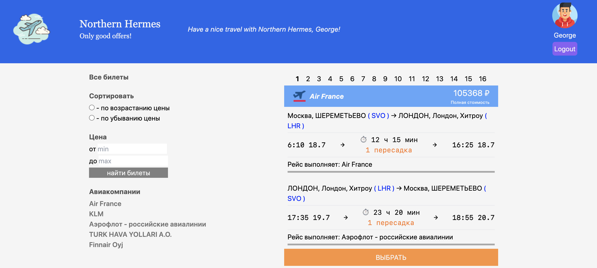
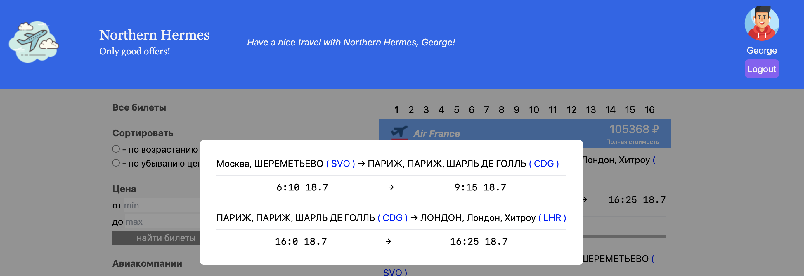

## Flight test

***

***

### Description

<i>This SPA about  doesn't have any state manager and uses combination 
of useContext and useState instead :
- includes two contexts:
    * [UserContext](#user);
    * [FlightsContext](#flights);
- __header__ for logout and opportunity to choose avatar;
- __footer__ for contacts; 
- **if you have transfer during flight, you can get all info about it just 
by a click;**

***

#### `UserContext`
<i>This part includes:
* input for your name (**required to start SPA**);
* option to choose avatar onClick action;

***

#### `FlightsContext`
This part includes:
* list of tickets;
* tools for sorting:
  * by increase price;
  * by decrease price;
  * by min and max price;
  * by carrier;

***

### Tech Stack

* [x] HTML;
* [x] TypeScript;
* [x] CSS/SCSS;
* [x] Tailwind CSS;
* [x] React JS;
* [x] React Hook Form

***

### Contacts

For feedback:`Gambit47@yandex.ru` 
Deployed:`https://new-todo-ten.vercel.app/`